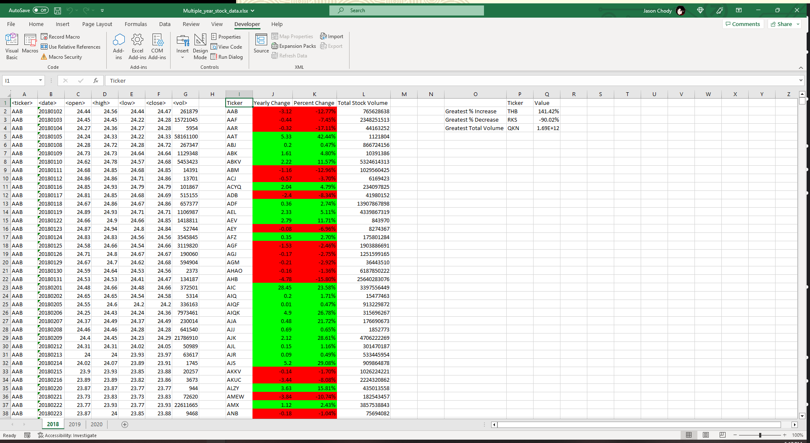
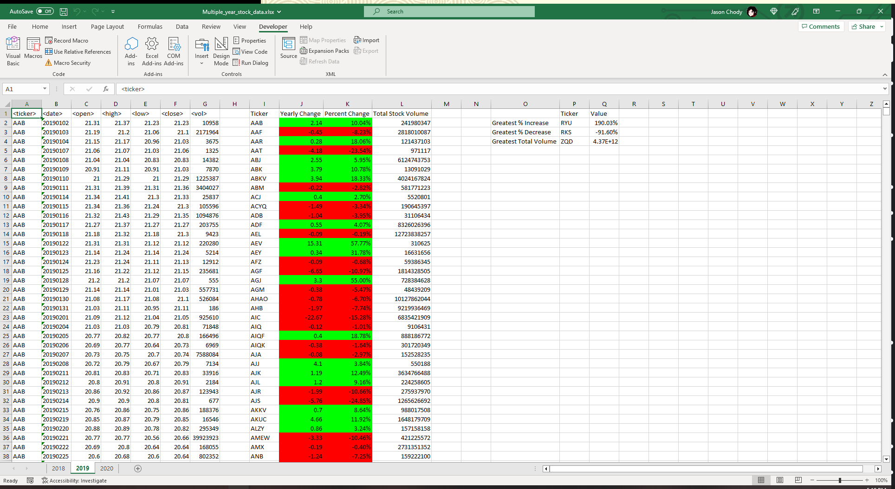
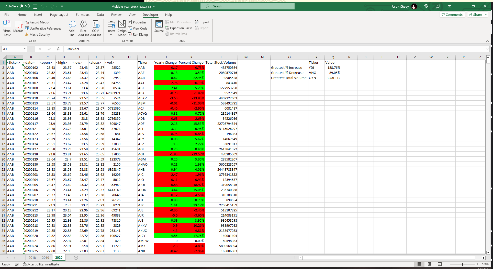

# Homework Assignment 2 - Stock Analysis VBA Script

## Description

This script, as per the instructions, loops through each sheet in a given worksheet, reading ticker symbols, open and closing prices, and trade volumes, in order to provide summaries for each ticker, highlighting growth in green and shrink in red. It then finds the greatest % increases and decreases, and the greatest total volume, and outputs those in a separate secton of the sheet.

I wasn't aware of just how much the script was supposed to do, versus what I was supposed to do, outside of the script. As such, the script handles everything. When run on the unmodified original spreadsheets, it produces a spreadsheet equivalent to that seen in the instructions screenshots, the sole exception being that it also conditionally formats the Percent Change column, per the grading scale.

## Notes

The script does not read or store any information that is not required for the output. This includes:

* It stores only the first instance of each ticker that it reads. Other instances are read and compared against the first, to find which index of the arrays to apply to, but they are not stored.

* It keeps a running tally of the earliest day in each year for each ticker, and the opening stock price for that day. If the earliest day is not the last in the list, it will not store every day, or every open price.

* It keeps a running tally of the latest day in each year for each ticker, and the closing stock price for that day. If the latest day is not the last in the list, it will not store every day, or every open price.

* It keeps a running tally of the total volume of trades for each ticker, meaning it only technically stores the first volume it reads for each ticker - every other day is read and then added to the current running total without, itself, being stored.

These choices were made in order to reduce the amount of unnecessary allocations made for variables to store that data, as they were unnecessary to produce the output described in the instructions. The grading scale description says that making those allocations was worth points. If not making those allocations loses me points, I will rewrite the script to make them and resubmit it.

The grading scale also says points are awarded for "separate VBA script files" - plural. Only one file was necessary to contain the script, so only one has been included. If the intent was to have a separate file for each of the starter code spreadsheets, I can copy it and resubmit.

Only one screenshot per year is provided, to show the results of the script. The number of expected screenshots was not given, but providing enough screenshots to show every bit of the results would 237 screenshots, which I figured was a bit over the top, especially since the script can be run to provide the results, directly, in much less time than it would take to compile all those screenshots.

### Sources

Any information on concepts not provided in class was gleaned from various online sources, including:

UBound - https://learn.microsoft.com/en-us/office/vba/language/reference/user-interface-help/ubound-function

ReDim - https://learn.microsoft.com/en-us/office/vba/language/reference/user-interface-help/redim-statement

Function - https://learn.microsoft.com/en-us/office/vba/language/reference/user-interface-help/function-statement

NumberFormat - https://learn.microsoft.com/en-us/office/vba/api/excel.range.numberformat

AutoFit - https://learn.microsoft.com/en-us/office/vba/api/excel.range.autofit

Conditional Formatting - https://www.automateexcel.com/vba/conditional-formatting/

Using the Trim function on a number that has been cast to a String to remove leading whitespace - https://techcommunity.microsoft.com/t5/excel/runtime-error-1004-method-range-of-object-global-failed/m-p/215590
